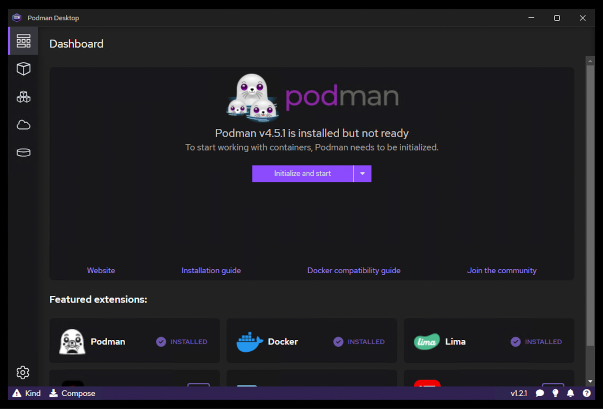
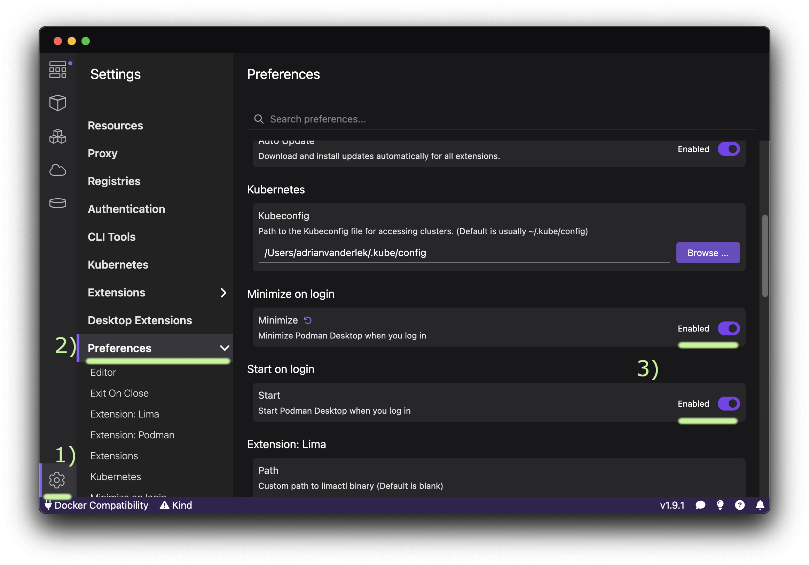
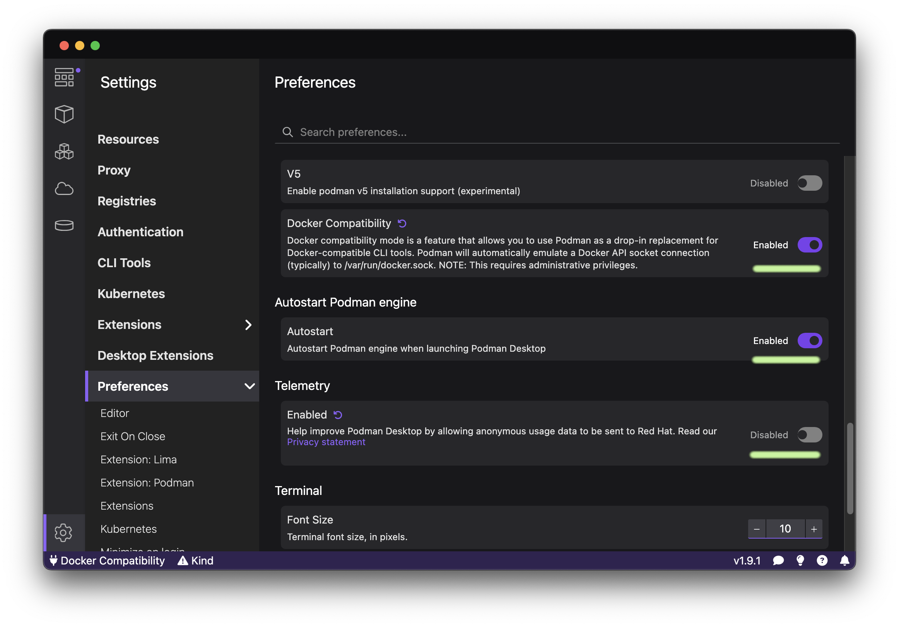

# Installation (macOS)

## TEI Publisher
1. Homebrew installieren: [https://brew.sh/](https://brew.sh/)
2. Podman via Homebrew installieren: `brew install podman podman-desktop`
3. Podman Desktop
    1. Podman Engine initialisieren und starten: 
    1. Podman Desktop beim Login starten und minimieren: 
    2. Docker-Kompatibilität und Autostart der Podman Engine aktivieren, Telemetrie deaktivieren: 
4. Podman-VM initialisieren und starten: `podman machine init && podman machine start`
5. Ins TEI Publisher-Verzeichnis wechseln: `cd ner_tei-publisher-app`
6. TEI Publisher Image erzeugen: `podman build -t existdb/tei-publisher-ner:local .`

## TEI Publisher NER API
1. Conda installieren: `brew install miniconda`
2. Conda initialisieren: `conda init zsh` (Terminal neu öffnen)
3. Conda-Environment für NER API anlegen: `conda create -n ner_api pip`
4. Environment aktivieren: `conda activate ner_api`
5  Ins Verzeichnis der NER API wechseln: `cd ner_api`
6. Requirements installieren: `pip install -r requirements.txt`

## NER CLI-Client
1. Conda-Environment für CLI-Client anlegen: `conda create -n ner_cli pip`
2. (optional) Environment in .zshrc hinterlegen `echo "conda activate ner_cli" >> ~/.zshrc`
3. Environment aktivieren: `conda activate ner_cli`
4. Ins Verzeichnis des CLI-Clients wechseln: `cd ner_cli`
5. Requirements installieren: `pip install -r requirements.txt`
6. NER-Script ausführbar machen: `chmod u+x ner`

# Workflow
1. Terminal 1: TEI Publisher und TEI Publisher NER API via `source start` starten.
2. Terminal 2: `conda activate ner_cli`
3. Ins Verzeichnis des CLI-Clients wechseln: `cd ner_cli`
4. Verarbeitung starten: `./ner -r -i ~/path/to/files`
5. Optional: TEI Publisher und NER API stoppen: `source stop`

# Troubleshooting & Sonstiges
1. Podman
    1. VM starten: `podman machine start`
    2. VM stoppen: `podman machine stop`
    3. Defekte VM löschen und reinitialisieren: `podman machine rm && podman machine init`
    4. Alle Container inkl. defekter entfernen, falls `podman rm <container_id>` fehlschlägt (Achtung): `podman container rm -fa`
    5. Falls TEI Publisher sich nicht mehr starten lässt, Instanz stoppen und Volume entfernen (Datenbank wird bei nächstem Start neu angelegt): `source stop && podman volume rm tei-publisher-ner`
    6. Ressourcenverbrauch laufender Container: `podman container stats`
2. NER API
    1. Server stoppen: `pkill -f uvicorn`
    2. Interaktive FastAPI-Dokumentation mit Testmöglichkeiten: (http://localhost:8001/docs)[http://localhost:8001/docs]
3. CLI-Client
    1. Verarbeitung pausieren: Ctrl+Z
    2. Verarbeitung fortsetzen: `fg`
    3. Annotiertes XML im TEI Publisher öffnen (Spalte URL in Tabelle): Befehlstaste (⌘) gedrückt halten und im Terminal auf URL doppelklicken (Verarbeitung pausieren, um Scrolling zu verhindern.)
