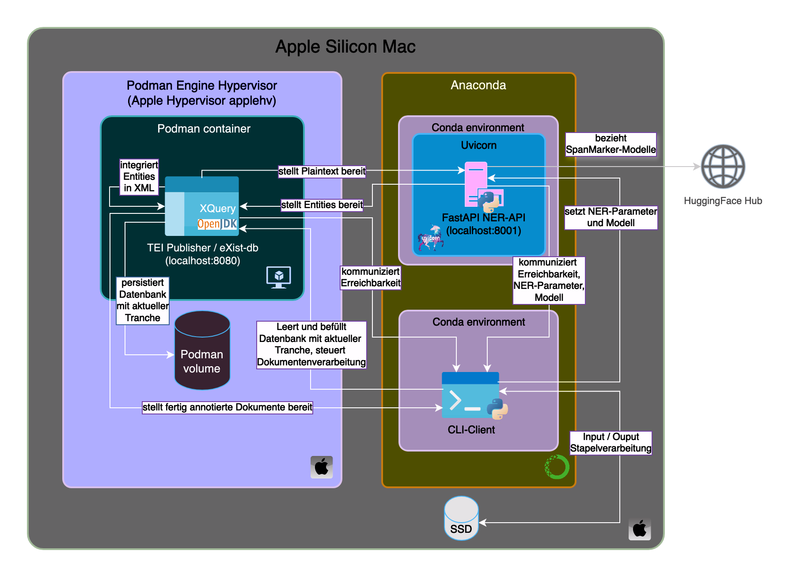

# Projekt «Named Entity Recognition für die Zentralen Serien des Staatsarchivs Kanton Zürich»

Dies Repo enthält Informationen und Code für das Projekt **«Named Entity Recognition für die Zentralen Serien des Staatsarchivs Kanton Zürich».**

Im Projekt haben wir eine **Eigennamenerkennung** (*Named Entity Recognition*) für grosse Dokumentsammlungen des Staatsarchivs entwickelt.

**Projektschritte**
1.   [Qualitative Tests von gängigen NER-Frameworks und Modellen auf den Korpora des Staatsarchivs](#qualitative-tests-von-g%C3%A4ngigen-ner-frameworks-und-modellen-auf-den-korpora-des-staatsarchivs).
2.   [Erstellen eines handannotierten Datensatzes (497 Samples)](#erstellen-eines-handannotierten-datensatzes).
3.   [Training und quantitative Evaluation eines NER-Modells mit SpanMarker](#training-und-quantitative-evaluation-eines-ner-modells-mit-spanmarker).
4.   [Entwicklung einer Produktivlösung auf Basis des XML-Werkzeugkastens TEI Publisher](#entwicklung-einer-produktivl%C3%B6sung-auf-basis-des-xml-werkzeugkastens-tei-publisher).

**Projektergebnisse**
-   [NER-Tests und -Entwicklung](https://github.com/machinelearningZH/named-entity-recognition_staatsarchiv/tree/main/notebooks) 
-   [Modifizierter TEI Publisher, der NER mit SpanMarker erlaubt](https://github.com/machinelearningZH/named-entity-recognition_staatsarchiv/tree/main/ner_tei-publisher-app) 
-   [NER API](https://github.com/machinelearningZH/named-entity-recognition_staatsarchiv/tree/main/ner_api)
-   [NER CLI-Client](https://github.com/machinelearningZH/named-entity-recognition_staatsarchiv/tree/main/ner_cli)

Unser vortrainiertes NER-Modell kann **[hier](https://huggingface.co/team-data-ktzh/span-marker-ktzh-stazh)** direkt vom Hugging Face Hub bezogen und unabhängig von den Softwarekomponenten in diesem Repository eingesetzt werden.

Das Projekt hat die [Abteilung «Data» des Statistischen Amts](https://www.zh.ch/de/direktion-der-justiz-und-des-innern/statistisches-amt/data.html) des Kantons Zürich gemeinsam mit dem [Staatsarchiv](https://www.zh.ch/de/direktion-der-justiz-und-des-innern/staatsarchiv.html) entwickelt.
-   Verantwortlich: **Adrian van der Lek, Rebekka Plüss**
-   Softwareentwicklung: **Adrian van der Lek**
-   Mitarbeit (Dokumentation, Organisation): Patrick Arnecke, Dominik Frefel

## Licensing

- [TEI Publisher - GPL-3.0](https://github.com/machinelearningZH/named-entity-recognition_staatsarchiv/blob/main/ner_tei-publisher-app/LICENSE)
- [Daten Staatsarchiv - Creative Commons CC-BY-SA 4.0](https://creativecommons.org/licenses/by-sa/4.0/deed.en)
- [Unser Code und NER-Modell - MIT](https://github.com/machinelearningZH/named-entity-recognition_staatsarchiv/blob/main/LICENSE.md)
- [Original NER-Modell GermEval 2014 NER - MIT](https://huggingface.co/stefan-it/span-marker-gelectra-large-germeval14)

## Inhaltsverzeichnis

* [Verwendung](#verwendung)
* [Begriffsdefinitionen](#begriffsdefinitionen)
* [Projektbericht](#projektbericht)
* [Training und Evaluation eines NER-Modells mit SpanMarker](#training-und-quantitative-evaluation-eines-ner-modells-mit-spanmarker)
* [Entwicklung einer Produktivlösung auf Basis TEI Publisher](#entwicklung-einer-produktivlösung-auf-basis-des-xml-werkzeugkastens-tei-publisher)
* [Diskussion](#diskussion)
* [Anhang](#anhang)
* [Nachweise](#nachweise)
* [Bibliographie](#bibliographie)

## Verwendung

Die Komplettinstallation des modular aufgebauten Systems ist im Dokument `INSTALLATION.md` beschrieben. Die NER API kann als 
-   Microservice einzeln eingesetzt werden,
-   zur gestützten (manuellen) Annotation von Dokumenten mit dem modifizierten TEI Publisher kombiniert werden,
-   sowie in zusätzlicher Kombination mit dem CLI-Client verwendet werden, um grössere Dokumentmengen zu verarbeiten (Gesamtsystem).

Das Gesamtsystem kann nach erfolgter Installation anhand der Beispieldaten wie folgt getestet werden (Export in `~/export`):
```bash
# Vom Repoverzeichnis aus:
source start
# Wenn nicht bereits aktiviert bzw. nicht in .bashrc oder .zshrc:
conda activate ner_cli 
# In einem zweiten Terminal-Fenster (wiederum vom Repoverzeichnis aus):
cd ner_cli 
./ner -r -i ../data/example_data -o ~/export
source stop
```
Eine ausführliche Erläuterung des CLI-Clients findet sich unter `ner_cli/README.md`.

## Begriffsdefinitionen

- Eigennamenerkennung, engl. *Named Entity Recognition*, fortan abgekürzt **NER** 
- Eigennamen wie Personen, Orte und allenfalls weitere Entitäten, engl. *Named Entity*, fortan abgekürzt **NE**

## Projektbericht

Die kantonale Verwaltung erzeugt und handhabt viele textliche Informationen und Dokumente. Die Identifikation von NEs bietet den Nutzenden gezieltere Suchmöglichkeiten in den Texten. Zudem bildet die NER die Basis für die Verknüpfung mit Normdaten wie der Gemeinsamen Normdatei (GND). Eine manuelle Auszeichnung ist - vor allem bei einer grossen Textmenge - zeitaufwändig bzw. nicht zu bewältigen. **Eine automatische oder teilautomatische Erkennung von NE würde viel Zeit sparen und die Arbeit mit Dokumenten an vielen Stellen verbessern.**

> **Unser Projekt zielt darauf, eine automatische Erkennung von Entitäten mit Machine Learning zu entwickeln und als generalisierbare technische Lösung für die kantonale Verwaltung zur Verfügung zu stellen.** 

Als Datenbasis für das Projekt verwenden wir die sogenannten **«Zentralen Serien des Staatsarchivs»**. Diese Korpora repräsentieren eine weite Spanne an Verwaltungssprache und Textsorten und stehen als offene Verwaltungsdaten (Open Government Data, OGD) zur Verfügung.

### Datensätze im Detail - die Zentralen Serien des Staatsarchivs

Das Staatsarchiv verantwortet neben vielen anderen Korpora auch die Archivierung und Erschliessung von den **«Zentralen Serien des Kantons Zürich 19. und 20. Jahrhundert»**. Dies sind Kantonsratsprotokolle, Regierungsratsbeschlüsse, Gesetzessammlungen und das Amtsblatt.

Die Korpora sind herausfordernd, weil sie von 1803 bis in die jetzige Zeit reichen und damit sprachlich und inhaltlich ein grosses Spektrum umfassen. Für das Staatsarchiv ist die Extraktion von Entitäten interessant, um Suchlösungen zu verbessern und Zusammenhänge zwischen den Serien analysieren und aufzeigen zu können.

#### Regierungsratsratsbeschlüsse (RRB)

-   Menge: ca. 575'000 Beschlüsse
-   Zeitraum Publikation auf Portal ZSZH: 1803 - 1995
-   [OGD-Datensatz 1803-1995](https://www.zh.ch/de/politik-staat/statistik-daten/datenkatalog.html#/datasets/466@staatsarchiv-kanton-zuerich)
-   [Publikationslösung (Quick Access)](https://archives-quickaccess.ch/search/stazh/rrb)

#### Kantonsratsprotokolle (KRP)

-   Menge: ca. 45'000 Traktanden
-   Zeitraum Publikation auf Portal ZSZH: 1803 - 2015
-   [OGD-Datensatz 1803-1995](https://www.zh.ch/de/politik-staat/statistik-daten/datenkatalog.html#/datasets/732@staatsarchiv-kanton-zuerich)
-   [Publikationslösung (Quick Access)](https://archives-quickaccess.ch/search/stazh/krp)

#### Gesetzessammlung (OS)

-   Menge: ca. 9500 Erlasse
-   Zeitraum Publikation auf Portal ZSZH: 1803 - 1998
-   [OGD-Datensatz 1803-1998](https://www.zh.ch/de/politik-staat/statistik-daten/datenkatalog.html#/datasets/712@staatsarchiv-kanton-zuerich)
-   [Publikationslösung (Quick Access)](https://archives-quickaccess.ch/search/stazh/os)

Die Serie «Amtsblatt» haben wir im Projekt nicht berücksichtigt, da die Aufbereitung Teil eines noch laufenden Projektes ist und daher noch keine Daten vorliegen. 

### Anforderungen

Bereits zu Projektbeginn fiel die Entscheidung, ein bestehendes Modell weiter zu optimieren (*finetunen*), anstatt ein komplettes Neutraining durchzuführen. 

Wir orientieren uns damit an der Ausrichtung des Modells, konkret den vortrainierten Typen von Entitäten und deren Interpretation. Wir haben NEs übernommen, sofern die Auszeichnung für uns nicht klar ungeeignet oder uneinheitlich ausfiel. Wir vermeiden so Korrekturaufwand und versuchen, das Modell in seinen bestehenden, robust erlernten Mustern möglichst zu bestätigen. Dies ermöglichte uns gute Resultate mit weniger Trainingsdaten. Auch gehen wir davon aus, dass unser optimiertes Modell so besser auf weitere Sammlungen generalisiert wie z.B. Amtsblattsmeldungen.

Die Daten liegen im XML-Format vor. Anforderung im Projekt ist, dass die NER möglichst nahtlos in die bestehenden Arbeitsabläufe integriert werden. Das Staatsarchiv setzt für ihre künftige, neue Publikationslösung den TEI Publisher ein. Erkannte NEs beziehen wir als XML-Dokument, zeichnen die NEs aus und rücküberführen die Ergebnisse in das ursprüngliche Dokument. 

Die Dokumente dürfen in ihrer Struktur und Inhalten nicht verändert werden. Dies stellt eine besondere Herausforderung dar, da wir den Rohtext des XMLs in der Vorverarbeitung nicht willkürlich extrahieren und bereinigen können. Konventionelle (d.h. nicht spezialisierte) NER-Verfahren können jedoch in der Regel nur einfachen Text verarbeiten. Sie sind zudem in unterschiedlichem Mass für Artefakte (z.B. doppelte Leerschläge) anfällig. Daher mussten wir eine geeignete Verarbeitungspipeline implementieren, die neben einem Pre- auch ein Postprocessing beinhaltet. 

Idealerweise möchten wir diese Pipeline bereits bei der Erstellung von Trainingsdaten einsetzen und der Ablauf soll eine gestützte Annotation erlauben. Dies würde allfällige Fehler und Grenzfälle in der Verarbeitung von XMLs seitens Pre- und Postprocessing sowie des Modells zutage fördern. Zugleich ist die manuelle Annotation von XMLs selbst mit spezialisierten Werkzeugen wie dem [XML-Editor Oxygen](https://www.oxygenxml.com/) nicht ausreichend komfortabel und die Erzeugung von eindeutigen Dokumentkennungen (IDs) anspruchsvoll. Gängige und ausgereifte Lösungen zur Annotation von Trainingsdaten arbeiten meist auf reinem Text. Die von uns zu Projektbeginn evaluierten, kostenlosen Lösungen ermöglichen leider keine komfortable modellgestützte Annotation.

Folgende Kriterien sollten somit erfüllt sein:

1. Erfassen von Zuordnungsinformationen bei der Extraktion des Plaintexts aus dem XML, welche die spätere Rücküberführung von erkannten NEs unter Berücksichtigung der strukturellen Heterogenität der Dokumente zuverlässig gewährleisten.
2. Erfassen von Indizes bei der Bereinigung des Texts, um die von der NER erkannten NEs dem ursprünglichen, nicht bereinigten Text zuordnen zu können.
3. Oberfläche oder Schnittstelle zwecks komfortabler Annotation von XML-basierten Trainingsdaten.

### Qualitative Tests von gängigen NER-Frameworks und Modellen auf den Korpora des Staatsarchivs

In einem ersten Schritt haben wir eine Reihe frei verfügbarer, vortrainierter Modelle auf drei Dokumenten unterschiedlicher Länge informell gesichtet. Bereits bei dieser minimalen qualitativen Evaluation kristallisierten sich überraschend klare systematische Unterschiede zwischen den Ansätzen heraus. Wir konnten so die Zahl der Modelle in Hinblick auf die im nächsten Schritt stattfindende vertiefte Evaluation reduzieren. 

-   Das grösste offizielle spaCy-basierte Modell mit NER-Unterstützung [`de_core_news_lg`](https://spacy.io/models/de#de_core_news_lg) fiel durch zahlreiche False Positives aus.
-   Ein BERT-basiertes Modell, das auf Schweizer Medientexten trainiert wurde, wies eine hohe Präzision aber geringe Ausbeute auf (technische Probleme sind hier nicht ausgeschlossen). [SpanMarker](https://github.com/tomaarsen/SpanMarkerNER).
-   Weitere Modelle fielen durch besonders gute Performanz, jedoch auch deutlich langsamere Verarbeitung auf. Das rechenintensivste, auf [German ELECTRA (GELECTRA) large](https://huggingface.co/deepset/gelectra-large) basierende Modell (im Folgenden als *SpanMarker Gelectra* bezeichnet) übertrifft die anderen drei deutschsprachigen Modelle, die auf der offiziellen SpanMarker-Webseite vorgestellt werden.
-  Positiv schnitt das [flairNLP](https://github.com/flairNLP/flair)-Modell [flair/ner-german-large](https://huggingface.co/flair/ner-german-large) ab, das zwar geringfügig mehr Fehler als SpanMarker Gelectra produzierte, allerdings auch ein erheblich höheres Verarbeitungstempo aufwies.

In der Annahme, dass sich die Leistung des spaCy-Modells durch weiteres Fine-Tuning verbessern lässt, haben wir uns beschränkt auf die Modelle SpanMarker Gelectra, spaCy `de_core_news_lg` und flairNLP `ner-german-large`. Für die weitere Evaluation benötigten wir erste annotierte Golddaten, deren Erstellung wir im Folgenden beschreiben.

### Erstellen eines handannotierten Datensatzes

#### Arbeitsumgebung

Der vom Staatsarchiv zwecks Veröffentlichung eingesetzte [TEI Publisher](https://teipublisher.com/exist/apps/tei-publisher-home/index.html) erwies sich als geeignete Lösung, um allen drei eingangs aufgeführten Kriterien zu genügen.  

Neben einer graphischen Oberfläche zur komfortablen Auszeichnung verfügt der TEI Publisher auch über eine API, die es erlaubt, das System als Komponente in eine automatisierte Verarbeitungspipeline einzubinden. Dies ermöglicht es dem Staatsarchiv ohne zusätzlichen Einarbeitungsaufwand, zukünftig selbst neue Trainingsdaten zu erstellen und neue Modelle zu trainieren. Schliesslich konnte auch die Auszeichnung von NEs mit eindeutigen IDs komfortabel an den TEI Publisher ausgelagert werden. Aus diesem Grund haben wir uns bereits zum Beginn dieses Projektschrittes entschieden, den TEI Publisher zu verwenden und projektspezifisch anzupassen.

Hilfreich erwies sich in diesem Zusammenhang die hohe Modularität des TEI Publisher, die es erlaubt, bestehende NE-Typen anzupassen [^1], neue NE-Typen hinzuzufügen (derivierte NEs), sowie Attribute der NE-Auszeichnungen im XML zu modifizieren [^2]. Zudem existiert in Form der [TEI Publisher Named Entity Recognition API](https://github.com/eeditiones/tei-publisher-ner) bereits ein massgeschneiderter NER-Server, der direkt im TEI Publisher zur gestützten Annotation von Dokumenten verwendet werden kann. Dies erlaubt rasche, provisorische Anpassungen, wodurch wir uns die gute Performanz des SpanMarker bereits zum Annotationszeitpunkt zunutze machen konnten. Da die NE-Extraktion jeweils manuell und pro Dokument angestossen wird, spielte auch die relativ langsame Verarbeitung von ca. 200 Token/Sekunde auf dem verwendeten System in diesem Zusammenhang keine Rolle.

Die so geschaffene Arbeitsumgebung erlaubte es uns, den Annotationsprozess erheblich zu beschleunigen und mit vertretbarem Aufwand hunderte von Dokumenten auszuzeichnen.

[^1]: Es war erforderlich, das ursprünglich erzwungenen Grounding gegenüber Referenzdatensätzen wie der Gemeinsamen Normdatei zu entfernen, um eine reine Auszeichnung zu ermöglichen.
[^2]: Unterscheidung von derivierte NE und Erzeugung einer UUID via XQuery.

#### Sampling

Die Sammlungen sind umfangreich, enthalten unterschiedliche Dokumententypen sowie ein breites Spektrum an Dokumentlängen. Die Korpora decken sprachliche Entwicklungen über einen Zeitraum von zwei Jahrhunderten mit den entsprechenden sprachlichen Veränderungen ab. Als domänenspezifisches Problem erwies sich zudem die relativ geringe Häufigkeit von konventionellen Organisationen (Firmen, NPOs, etc.), die wir nur über ein gesondertes Sampling behandeln konnten. Um mit unseren begrenzten zeitlichen und personellen Ressourcen trotzdem möglichst viele Daten annotieren zu können, haben wir ein dreiteiliges, datengetriebenes Sampling angewandt:

1. Binning der Dokumente nach Länge in sechs Bins, um Längeneffekte abzubilden.
2. Binning der Dokumente nach Länge in zehn Bins und Einschränkung auf (ungefähr) mittlere zwei bis fünf Bins, um Längeneffekte gegenüber der Zeitkomponente und anderen Variablen zu dämpfen.
3. Toolgestützte (nicht zufällige) Suche nach Dokumenten, in denen Organisationen stark repräsentiert sind.

#### Definitorische Überlegungen zu NEs

Im Einklang mit der eingangs erläuterten Ausrichtung an Modelleigenheiten verzichteten wir darauf, die einzelnen NE-Typen abschliessend zu definieren und haben Modelleigenheiten nach Möglichkeit übernommen [^3]. Besonders bei Orten und Organisationen beabsichtigten wir, relativ grosszügig mit bestehenden Auszeichnungen und deren definitorischen Unschärfen umzugehen. Im Rahmen des Annotationsschemas wollten wir dennoch eine möglichst hohe Präzision (*precision*) erreichen. Die Ausbeute (*recall*) ist aus Kundensicht weniger kritisch.

Die vom Basismodell unterstützten Teil-NEs (`...part`) haben wir ausgeschlossen. Es handelt sich im Rahmen des GermEval 2014-Datensatzes, der die Trainingsgrundlage des SpanMarker Gelectra-Modells bildet, aus technischen Gründen nicht um eine Subtokenannotation, sondern um eine Auszeichnung ganzer Token, die an unspezifizierter Stelle eine Teil-NE enthalten (z.B. \[Europa\]wahlen,\[US-\]Präsident)). Diese Handhabe war mit den Anforderungen des Staatsarchivs nicht vereinbar. Nicht ausgezeichnet werden verschachtelte NE, da weder SpanMarker Gelectra noch die API des TEI Publishers diese (vollständig) beherrschen.

[^3]: Ein Beispiel hierfür ist das Weglassen von Anreden bei Personen durch SpanMarker Gelectra, die von anderen Modellen zur NE hinzugezählt werden.

Bei der Auszeichnung wurden allgemein Personen-, Orts- und Organisationsnamen im wörtlichen Sinne ausgezeichnet. So wird "AHV" in "Bezüger von AHV" als Organisation ausgezeichnet, auch wenn hier metonymisch eine AHV-Rente gemeint ist. Gleiches gilt für Personennamen, die textsemantisch als stellvertretend für Firmen gelesen, aber nicht eindeutig einer bekannten Firma (z.B. "Yves Rocher") zugeordnet werden können (Personennamen mit Firmenkürzel oder Präfix "Firma" werden als Organisationen ausgezeichnet). Eine Ausnahme stellen Begriffe dar, die metonymisch (weitgehend) eindeutig für Institutionen stehen, z.B. "der Kanton", "der Bund", und die als Organisationen ausgezeichnet werden.

Bei Organisationen wird grundsätzlich die längstmögliche Sequenz ausgezeichnet.

NEs im Titel von XML-Dokumenten werden nicht ausgezeichnet, da dies vom TEI Publisher nicht unterstützt wird. Dies akzeptieren wir im Bewusstsein, dass in einigen Dokumenten saliente NEs ausschliesslich im Titel vorkommen.

##### Personen

Titel und Anreden werden grundsätzlich weggelassen. Ausnahmen stellen Adelstitel dar, z.B. "Erzherzog". Konjunktionen von Nachnamen werden als Organisationen behandelt. Derivierte Personennamen (z.B. "Tanner" -> "Tannersche") wurden ebenfalls ausgezeichnet, aufgrund ihrer sehr geringen Häufigkeit (in den Trainingsdaten nur vereinzelt in den Regierungsratsbeschlüssen des 19. Jahrhunderts) ist jedoch keine verlässliche Klassifikation zu erwarten.

##### Orte

Neben eindeutigen Ortsbezeichnungen wurden auch kontextuell eindeutige und vagere Umschreibungen berücksichtigt (z.B. Bahnhofsquai, Limmatraum, Limmat). Disambiguierende Präfixe (z.B. "\[Kanton\] Zürich") werden weggelassen. Hierarchische Ortsbezeichnungen (Dillhaus / Saland, Kehlhof - Stäfa) werden getrennt ausgezeichnet.
Bindestrich-verknüpfte Verkettungen von Ortsnamen (z.B. Bahnlinien) werden als zusammenhängendes Token nicht ausgezeichnet.
Derivierte Ortsnamen werden ausgezeichnet (z.B. "Zürcher", "schweizerischen", "St.Galler").

##### Organisationen

Ergänzend zu klassischen Organisationen (Unternehmen, sehr spezifische und eindeutige Institutionen wie z.B. Universitäten) berücksichtigen wir Institutionen, die unterschiedlich konkret sind und teilweise als Organisation, teils im abstrakten Sinne gelesen werden können. Besonders unterspezifizierte aber im Kontext der Sammlungen (Regierungsrat, Kantonsrat, Kanton Zürich) weitgehend eindeutig auflösbare NEs berücksichtigen wir grosszügig [^4]. Dazu gehören auch Organisationen, die unter einer übergeordneten Organisation angesiedelt sind [^5]. Ebenfalls ausgezeichnet werden Organisationen, die temporärer Art sind (zeitweise eingesetzte Kommission) oder in einem Dokument lediglich hypothetischer Art sind, also zu einem späteren Zeitpunkt anderslautend oder gar nicht existieren.

[^4]: Beispiele: Staat, Regierung, Bundesrat, Regierungsrat, Kantonsrat, Kantonsratsbüro, Kanton (alleinstehend, nicht als Präfix), Kantonale Gebäudeversicherung, Erweiterte Justverwaltungskommission, Finanzkommission, Redaktionskommission, historisches Seminar (der Universität Zürich), Verkehrspolizei, Justizdirektion, kantonale Polizeidirektion, Geschäftsprüfungskommission, römisch-katholische Kirchgemeinden

[^5]: Beispiele:  Kleiner Studentenrat KStR, Grosser Studentenrat GStR innerhalb der Universität Zürich

Nicht ausgezeichnet werden Konjunktionen ("Am journalistischen und am historischen Seminar"). Im Falle von Konjunktionen, die eingeschachtelte freistehende Entitäten enthalten, die zumindest kontextuell ausreichend eindeutig sind, erfolgt eine Auszeichnung ("Kantonsspitäler \[Zürich<sub>LOC</sub>\] und \[Winterthur<sub>LOC</sub>\], "\[Direktionen der Finanzen und des Militärs<sub>ORG</sub>\]")

Derivierte Organisationen werden ausgezeichnet, sind jedoch selten und von geringer Varianz (v.a. allgemeine Institutionsbezeichnungen, z.B. "kantonale", "parlamentarische", vereinzelt spezifischere wie "bundesrätliche", "bundesgerichtliche").

#### Erkenntnisse

Die Auszeichnung von Personen hat sich als am einfachsten erwiesen, gefolgt von Orten, die einen grösseren definitorischen Spielraum aufwiesen. Die grösste Heterogenität und definitorischen Unschärfen zeigten erwartungsgemäss Organisationen.

#### Mapping von NER zu XML-Tags

Den von der NER ausgezeichneten Labels werden von der NER API XML-Tags zugeordnet. Dabei handelt es sich um standardisierte Tags gemäss TEI-Richtlinie (`PER` -> [persName](https://tei-c.org/release/doc/tei-p5-doc/de/html/ref-persName.html), `LOC` -> [placeName](https://tei-c.org/release/doc/tei-p5-doc/de/html/ref-placeName.html), `ORG` -> [orgName](https://tei-c.org/release/doc/tei-p5-doc/de/html/ref-orgName.html)). Für derivierte NEs (`...deriv`) wird ein zusätzliches Attribut `type="deriv"`vergeben. Zudem wird als eindeutige ID eine zufällig generierte UUIDv4 für das Attribut [n](https://tei-c.org/release/doc/tei-p5-doc/de/html/ref-att.global.html#tei_att.n) vergeben. 
```xml
... <placeName n="a4fe6fe3-1671-461c-be6f-e31671561c68">Winterthur</placeName> ... 
... <persName n="b3c96f8b-400d-4573-896f-8b400d15730c">Hansjörg Budliger</persName> ... 
... <orgName n="2e4de01e-b9a9-48ca-8de0-1eb9a9c8ca89">Bundesversammlung</orgName> ... 
... <persName n="e6e731c8-a093-424f-a731-c8a093824ff8" type="deriv">Tannerschen</persName> ... 
... <placeName n="d6919fb0-6db8-41a3-919f-b06db8c1a3b5" type="deriv">Bündner</placeName> ... 
... <orgName n="3e89bffe-b7bf-4181-89bf-feb7bfc181ee" type="deriv">bundesgerichtliche</orgName> ... 
```

#### Annotationsprozedere

Wir haben gestützt annotiert - dies zunächst mit dem SpanMarker-Basismodell [stefan-it/span-marker-gelectra-large-germeval14](https://huggingface.co/stefan-it/span-marker-gelectra-large-germeval14), dann mittels sukzessiv auftrainierter Modelle, was den Korrekturbedarf erheblich reduzierte.

Der annotierte Korpus umfasst insgesamt **497** Dokumente.

| **Sample**   | **# Dokumente** | **∅ Tokenzahl** | **# PER** | **# LOC** | **# ORG** | **# PERderiv** | **# LOCderiv** | **# ORGderiv** |
|--------------|----------------|-----------------|-----------|-----------|-----------|----------------|----------------|----------------|
| KRP 19. Jhd. | 69             | 506             | 280       | 173      | 343       | -              | 7              | 13             |
| KRP 20. Jhd. | 124            | 2809            | 1561      | 2020     | 2397      | -              | 89             | 118            |
| RRB 19. Jhd. | 123            | 869             | 261       | 443      | 826       | 7              | 36             | 19             |
| RRB 20. Jhd. | 70             | 1129            | 290       | 894      | 892       | -              | 20             | 24             |
| GSZH         | 106            | 2849            | 228       | 570      | 1234      | -              | 52             | 74             |


Mit einem informellen Selbsttest haben wir in einer Abwandlung der Kreuzvalidierung anstelle der Testdaten die Trainingsdaten vorhergesagt, um allfällige Widersprüche zu identifizieren. Dabei haben wir trotz des informellen und pragmatischen Annotationsprozederes ohne Überprüfung der [Inter- und Intrarater-Reliabilität](https://de.wikipedia.org/wiki/Interrater-Reliabilit%C3%A4t) in sämtlichen Teildatensätzen nur minimale Einbussen beobachtet. Dies stützt gemeinsam mit den Resultaten der Kreuzvalidierung über Testdaten die Erkenntnis, dass der SpanMarker in Verbindung mit der ELECTRA large-Architektur gegenüber Schwankungen und interpretativem Drift im Zeitverlauf, die ohne rigorose Annotationsprozedur kaum vermeidbar sind, robust ist.

### Quantitative Evaluation vortrainierter Modelle

Die Evaluation wurde auf einem Datensatz von 70 vorläufig annotierten Kantonsratsprotokollen des 20. Jahrhunderts durchgeführt. Die Annotation wurde im Nachgang nochmals überarbeitet und vereinheitlicht, dennoch ragt bereits über diesen "verrauschten" Daten SpanMarker Gelectra eindeutig und lückenlos als performantestes Modell für sämtliche Labels hervor. Im Gegensatz zum Ersteindruck im Rahmen der qualitativen Evaluation lässt das Modell zudem auch das flair-Modell deutlich hinter sich.

| **Modell**                | **Label** |        **P** |        **R** |       **F1** |
|---------------------------|----------:|-------------:|-------------:|-------------:|
| spaCy de_core_news_lg     |    PER    | 0.662955     | 0.711183     | 0.686223     |
|                           |    LOC    | 0.529794     | 0.747706     | 0.620165     |
|                           |    ORG    | 0.538895     | 0.572455     | 0.555168     |
| SpanMarker Gelectra       |    PER    | **0.811040** | **0.829533** | **0.820183** |
|                           |    LOC    | **0.892248** | **0.879969** | **0.886066** |
|                           |    ORG    | **0.881579** | **0.722156** | **0.793943** |
| flairNLP ner-german-large |    PER    | 0.711721     | 0.731813     | 0.721627     |
|                           |    LOC    | 0.848439     | 0.851682     | 0.850057     |
|                           |    ORG    | 0.828927     | 0.638323     | 0.721245     |


Aufgrund der Performanz des flair-Modells und des auf [Huggingface Transformers](https://huggingface.co/docs/transformers/index) aufbauenden SpanMarkers weitaus weniger ausgereiften Toolings haben wir darauf verzichtet, ein Fine-Tuning dieses Modells vorzunehmen. Dies auch, da wir die deutlich höhere Rechenintensität von SpanMarker Gelectra als vertretbar eingeschätzt haben.

Sowohl das spaCy-Modell als auch SpanMarker Gelectra haben wir probehalber auf dem obigen Datensatz verfeinert, wobei wir nach wie vor einen Vorsprung beim SpanMarker-Modell festgestellt haben. Im Zuge der quantitativen Evaluation vortrainierter Modelle haben wir uns daher definitiv für SpanMarker Gelectra als Grundmodell entschieden.

## Training und quantitative Evaluation eines NER-Modells mit SpanMarker

### Modell

Wie eingangs erläutert, haben wir uns für ein Fine-Tuning eines bestehenden Modells entschieden, um die Generalisierbarkeit des Modells auf andere Datensätze möglichst beizubehalten.

#### Modellbeschreibung
- **Modelltyp:** [SpanMarker](https://github.com/tomaarsen/SpanMarkerNER)
- **Encoder:** [deepset/gelectra-large](https://huggingface.co/deepset/gelectra-large) (ELECTRA Large)
- **Maximale Sequenzlänge (Subtoken):** 256 tokens
- **Maximale Entitätenlänge:** 8 words

#### Training-Hyperparameter
- Lernrate: Polynomialer Decay von 1e-05 bis 5e-07 
- Batchgrösse Training: 4
- Seed: 42
- Optimierungsverfahren: AdamW mit betas=(0.9, 0.999), epsilon=1e-08, weight_decay=0.01
- Lernratenscheduler: Polynomisch (kubisch)
- Warmup-Ratio: 0.05
- Anz. Epochen: 10
- Gradientenakkumulationsschritte: 2
- Schritte: 16'000

### Resultate

#### Kreuzvalidierung (5-CV)

Die Evaluation beruht auf dem internen SpanMarker-Evaluationscode, der auf [`seqeval`](https://github.com/chakki-works/seqeval) aufbaut.

#### Mittlere Metriken über alle Folds pro Label
| Label    |    P |    R |   F1 |
|:---------|-----:|-----:|-----:|
| PER      | 0.97 | 0.97 | 0.97 |
| LOC      | 0.95 | 0.96 | 0.96 |
| ORG      | 0.92 | 0.95 | 0.93 |
| PERderiv | 0.40 | 0.30 | 0.33 |
| LOCderiv | 0.86 | 0.85 | 0.85 |
| ORGderiv | 0.73 | 0.76 | 0.74 |

#### Gesamtmetriken pro Fold
| Fold  |  P |  R  | F1 | A |
|:-----:|:---------------------:|:------------------:|:-------------:|:-------------------:|
| 0     |  0.927                | 0.952              | 0.939         |  0.992              |  
| 1     |  0.942                | 0.957              | 0.949         |  0.993              | 
| 2     |  0.938                | 0.946              | 0.942         |  0.992              | 
| 3     |  0.921                | 0.951              | 0.936         |  0.992              | 
| 4     |  0.945                | 0.949              | 0.947         |  0.993              |


*Baseline - Mittlere Performanz anhand fixem vortrainiertem Modell pro Fold einer fünffachen Kreuzvalidierung*


*Finales Modell - Mittlere Performanz pro Fold einer fünffachen Kreuzvalidierung. Die Performanz über den Haupt-NE-Typen PER, LOC und ORG konnte praktisch durchgehend deutlich verbessert werden.*


*Mittlere Häufigkeiten von Entities pro Fold einer fünffachen Kreuzvalidierung. Zu beachten ist die deutlich erhöhte Häufigkeit von Organisationen durch gezieltes Nachsamplen.*


*Konfusionsmatrix über sämtliche Folds einer fünffachen Kreuzvalidierung (inkl. nicht berücksichtigter Labels des Basismodells). Verwechslungen zwischen NE-Typen sind selten.*

#### Behandlung derivierter NEs

Wir haben darauf verzichtet, derivierte Entitäten nachzusampeln, da diese wenig Heterogenität aufweisen und wir diese für unsere Anwendung als nebensächlich einstufen. Zwecks Qualitätsverbesserung haben wir für den produktiven Einsatz anhand einer Precision-Recall-Kurve über den Folds der Kreuzvalidierung einen Schwellenwert errechnet, der einer Präzision von 0.8 entspricht. Für die Haupt-NE-Typen haben wir wegen der guten Performanz auf die Verwendung eines Schwellenwerts verzichtet.

### Erkenntnisse

Die diachronen Sprachveränderungen in den Korpora der Kantonsratsprotokolle und Regierungsratsbeschlüsse erwiesen sich als erstaunlich unproblematisch. Bei einem Teil der NE-Typen erzielt das Modell in der Kreuzvalidierung über den Teilkorpora des 19. Jahrhunderts sogar eine geringfügig höhere Präzision, trotz geringerer - bzw. im Falle von Kantonsratsprotokollen sogar erheblich geringer - Entitätsvorkommen. Dies deutet darauf hin, dass das Modell strukturelle Gemeinsamkeiten von Protokollen und Beschlüssen, die sich auf Satzebene widerspiegeln, dank ihres formulaischen Aufbaus erlernt und von der syntaktisch und semantisch erheblich variierenden Oberflächenstruktur gut abstrahieren kann.

Einzig die Gesetzessammlung fällt durch eine erkennbar (aber vertretbar) geringere Präzision auf, was in Anbetracht der höheren sprachlichen Komplexität, weniger trennscharfen institutionellen Organisationsauszeichnungen und grösseren Heterogenität zu erwarten ist.

Gemischte Erfolge sehen wir bei den mengenmässig schwach vertretenen und v.a. in Kantonsratsprotokollen des 20. Jahrhunderts und der Gesetzessammlung vorkommenden derivierten Entitäten. Derivierte Personennamen beobachten wir mit Ausnahme weniger Vorkommen in Regierungsratsbeschlüssen des 19. Jahrhunderts kaum. Wir betrachten diese als rein historische und selbst dann seltene Variation an dieser Stelle nicht weiter. Gute Leistungen verzeichnen wir für derivierte Orte in Kantonsratsprokollen (20. Jhd), sowie trotz relativ geringer Vorkommen in den Regierungsratsbeschlüssen (20. Jhd.). Auf der Gesetzessammlung ist die Auszeichnung trotz zweithöchstem Vorkommen eher bescheiden, was in Einklang mit der geringeren Performanz in Zusammenhang mit den Haupt-NE-Typen steht.

Da das Modell bei der Standardlearningrate von 5e-5 rasch konvergiert, haben wir zusätzlich kleinere Lernraten evaluiert. Eine Lernstrategie mit abnehmender Lernrate konvergiert dabei schneller, als eine Strategie mit geringer fixer Lernrate. Da das Modell auch bei einer linear abnehmenden Lernrate schnell konvergiert, haben wir final eine polynomial abnehmende Lernrate mit Polynompotenz 3 verwendet, was in einem informellen Test auf einem Teildatensatz zu einer minimalen Verbesserung führte. Aus zeitlichen Gründen und aufgrund ausreichender Leistung haben wir auf eine rigorose Evaluation auf den vollständigen Trainingsdaten verzichtet.

## Entwicklung einer Produktivlösung auf Basis des XML-Werkzeugkastens TEI Publisher

### Aufbau

#### TEI Publisher

Wie eingangs erläutert, war für die nötige Rücküberführung von Entitätsauszeichnungen in XMLs zu Beginn der Entwicklungsarbeiten keine robuste Python-Library oder Komponente bekannt. Aus diesem Grund haben wir entschieden, den TEI Publisher in die Annotationspipeline einzubinden und die damit verbundene Steigerung in Bezug auf Overhead, Latenz und architektonischer Komplexität in Kauf zu nehmen.

#### NER API

Die zu Annotationszwecken modifizierte Version des TEI Publishers wird mit minimaler Bereinigung als Komponente der Produktivlösung bereitgestellt.

Die TEI Publisher NER API von [e-editiones](https://www.e-editiones.org/) baut auf spaCy auf, was uns erlaubt hat, Codeänderungen in der vorliegenden Fassung zu minimieren. spaCy wurde zwecks Preprocessing verwendet. So konnten wir die Satztokenisierung von spaCy nutzen, einen Segmentierungsfallback für überlange Sätze basierend auf der Subtokenlimite des SpanMarkers einbinden und zusätzliche Entities per Regex-Matcher auszeichnen.

Vor der Verarbeitung durch die spaCy-Pipeline bereinigen wir doppelte Leerschläge, Zeilenumbrüche, Tabulatoren und non-breaking Spaces, indem wir diese durch einzelne Leerschläge ersetzen, sowie Whitespace am Anfang und Ende entfernen. Damit vermeiden wir Fehler bei der Verarbeitung durch SpanMarker. Wir erfassen Offsets zum ursprünglichen Text, um die Grenzen der erkannten Entities in Relation zu diesem zu berechnen, was seitens TEI wiederum die Rücküberführung ins XML ermöglicht. Mittels spaCys sentencizer, einer schnellen Satzsegmentierung die kein Dependenzparsing erfordert, trennen wir den eingehenden Text in Sätze. Eine nachgeschaltete Komponente trennt Sätze weiter auf, welche die Subtokenlimite des SpanMarkers überschreiten. Damit gewährleisten wir, dass bei der Verarbeitung keine NEs verloren gehen. Das SpanMarker-Modell haben wir als letzte Komponente in die spaCy-Pipeline eingebunden.

Eine gesonderte spaCy-Komponente (Matcher), die nicht in die spaCy-Pipeline integriert ist, verwenden wir zur optionalen Auszeichnung von Orten innerhalb von mittels SpanMarker erkannten Organisationen anhand eines regulären Ausdrucks. Die API des TEI Publisher unterstützt die eingeschachtelte Annotation von NEs, stellt diese jedoch nicht über die Trainingsdatenschnittstelle bereit, weshalb wir hier auf eine Evaluation verzichtet haben.

Die aus Zeitgründen ebenfalls nicht evaluierte, optionale Auszeichnung von Datumsausdrücken erfolgt getrennt von der spaCy-Pipeline ebenfalls über einen regulären Ausdruck. Dies erhöht die Verarbeitungsgeschwindigkeit bei ausschliesslicher Datumserkennung um ein Vielfaches.

Detailiertes README: `ner_api/README.md`

#### CLI-Client

Der CLI-Client ist ein einfaches Batchverarbeitungstool, das über Abfragen an die API des TEI Publishers die Einspeisung von Dokumenten in dessen Datenbank, die Erkennung von NEs und deren Rücküberführung ins XML, sowie den Download der Dokumente automatisiert. Das Tool überprüft die Verfügbarkeit des TEI Publishers und der NER API und erlaubt, Taggingeinstellungen und das geladene Modell in der API zur Laufzeit zu übersteuern. Es handhabt und loggt zudem bekannte Fehler (siehe Abschnitt «Einschränkungen») und führt eine Differenzprüfung am Reintext des finalen Dokuments durch. Im Terminal werden neben dem Fortschritt fortlaufend Informationen und Statistiken zu verarbeiteteten Dokumenten ausgegeben, sowie eine URL, anhand der annotierte Dokumente des aktuellen Unterverzeichnisses (Tranche) im Web-Frontend des TEI Publishers gesichtet werden können. 

Bei der Entwicklung des CLI-Clients haben wir weitgehend auf externe Abhängigkeiten verzichtet, was den Wartungsaufwand minimiert.

Detailiertes README: `ner_cli/README.md`

### Betrieb



*Architektur einer (lokalen) Installation auf einem Apple Silicon Mac. Anstelle von Anaconda kann auch miniconda oder ein einfaches Python virtualenv verwendet werden. Eine Tranche entspricht einem Unterverzeichnis (bei nichtrekursiver Verarbeitung eines Verzeichnisses resultiert nur eine Tranche)*

Den TEI Publisher betreiben wir als Podman-Container innerhalb des Hypervisors (unter macOS seit Podman 5.0.0 der native Hypervisor applehv), wobei wir ein Volume anbinden, um den Inhalt der Datenbank bei Beendigung oder Neustart des Containers zu persistieren. [Podman](https://podman.io/) verwenden wir als drop-in-Ersatz für Docker. Die NER API wird direkt unter macOS in einem Anaconda environment oder Python virtualenv betrieben, um die GPU des M2 Max SoCs ansprechen zu können. Die NER API ist als [FastAPI](https://fastapi.tiangolo.com/) realisiert und wird als [uvicorn](https://www.uvicorn.org/)-Server betrieben.

Der CLI-Client läuft in einem separaten Environment. Im Falle einer x86-Installation mit Nvidia GPU unter Linux lässt sich auch die API containerisieren, was wiederum die komfortable Verwaltung der Server via podman-compose ermöglicht.

## Diskussion

### Erkenntnisse

Das Basismodell erwies sich im Einklang mit der eingangs durchgeführten qualitativen und quantitativen Evaluation als ausgezeichnete Grundlage für ein weiterführendes Training, mit der wir die Modellleistung im Hinblick auf die Zieldokumentreihen durchgehend erheblich verbessern konnten. Entgegen unseren ursprünglichen Erwartungen erwies es sich als unnötig, getrennte Modelle für modernere und ältere Sprache zu trainieren, da die Kombination aller Korpora zu einem gemeinsamen Trainingsset nicht zu zeitraumspezifischen Einbussen führte. Tatsächlich schneidet das Modell über dem mengenmässig relativ schwach besetzten Teilkorpus der Kantonsratsprotokolle des 19. Jahrhunderts ähnlich wie auf jenem des 20. Jahrhunderts ab, trotz ca. sechsfach geringerer NE-Vorkommen. Aufgrund der Anwendungsorientierung des Projekts haben wir auf Ablationsexperimente verzichtet. Zugleich sehen wir darin zumindest ein Indiz, dass Kantonsratsprotokolle und Regierungsratsbeschlüsse von korporaübergreifenden Gemeinsamkeiten trotz erheblich abweichenden Oberflächenformen und -strukturen profitieren und der SpanMarker diese gut erlernen kann. Darauf deutet für uns auch die eindeutig niedrigere Performanz über sämtlichen Hauptentitäten in der Gesetzessammlung hin (trotz ähnlicher NE-Häufigkeiten wie in den Regierungsratsbeschlüssen), die hinsichtlich Struktur und Textsemantik einer weiter entfernten Textgattung zuzuordnen ist.

Sehr erfreulich ist, dass Verwechslungen zwischen NE-Typen äusserst selten vorkommen. Abstriche bei der Performanz sind praktisch ausschliesslich auf nicht erkannte NEs, sowie in vergleichbarer Grössenordnung auf fälschlicherweise ausgezeichnete Nicht-NEs zurückzuführen.

Ebenfalls bestätigt sich weitgehend die bereits eingangs vermutete Rangordnung im Schwierigkeitsgrad der Erkennung: Personennamen lassen sich am leichtesten erkennen, gefolgt von Orten und schliesslich Organisationen, welche die mit Abstand höchste Heterogenität aufweisen. Mit dem bewussten Oversampling von Dokumenten mit Organisationen konnten wir die Lücke zu den anderen NEs verkleinern.

Mit dem SpanMarker-Modell konnten wir einen Kompromiss finden, der im Vergleich zu spaCy- und flairNLP-basierten Ansätze zwar erheblich rechenintensiver ist. Auf einem leistungsfähigen Workstationnotebook wie dem von uns verwendeten MacBook Pro M2 Max lassen sich bei einer Verarbeitungsrate von rund 200 Token/Sekunde jedoch auch grössere Dokumentenkorpora innert weniger Tage auszeichnen. Aufgrund des bescheidenen Grafikspeicherbedarfs von ca. 3 GB gibt es zudem keine Mindestanforderungen in Bezug auf den kostspieligen Grafikspeicher. Das Training eines Modells ist bei der verwendeten Hardware und Korpusgrösse in rund acht Stunden möglich [^6]. Dies erlaubte es uns, auf eine Auslagerung auf externe Server bzw. Cloudinstanzen zu verzichten, was wiederum die Verarbeitung auch von sensiblen Daten erleichtern würde [^7].

[^6]: Anmerkung: Das Training setzt deutlich mehr Grafikspeicher voraus - eine Anforderung, der die geteilte Speicherarchitektur von Apple Silicon Macs sehr entgegenkommt.
[^7]: Anmerkung: Unter Einhaltung von adäquaten Sicherheitsvorkehrungen, die im vorliegenden Projekt aufgrund der öffentlichen Verfügbarkeit sämtlicher Daten nicht vertieft wurden.

### Einschränkungen

- Die Ausgangsfassung der TEI Publisher API erlaubt es, spaCy-Pipelines dynamisch zu laden, zu exportieren und via TEI Publisher zu trainieren. Aus praktischen Gründen haben wir diese Funktionalität entfernt. SpanMarker-Modelle müssen extern trainiert werden.
- Das Modell ist auf in XMLs ausgezeichneten und von der TEI Publisher-API bereitgestellten Paragraphen trainiert, während die Anwendung auf Sätzen erfolgt. Im Rahmen der iterativen gestützten Annotation von Trainingsdaten haben wir keinerlei Probleme, die dieser Diskrepanz zuzuordnen sind. Weiter weist der SpanMarker-Trainer lediglich ~4% der Entities aus, die beim Training aufgrund der Subtokenlimite nicht berücksichtigt wurden. Aus diesem Grund haben wir auf eine Satzsegmentierung der Trainingsdaten verzichtet. Wir räumen jedoch die Möglichkeit einer minimalen Performanzverbesserung bei zusätzlicher Satztokenisierung ein.
- Die NER kann nicht für die verlässliche Auszeichnung von NEs in Tabellen verwendet werden, da das Modell auf die Verarbeitung von Fliesstext ausgelegt ist. Tabellenzeilen werden vom TEI Publisher als unstrukturierter Plaintext ohne klare Grenzen zwischen Tabellenzellen bereitgestellt, der vom SpanMarker nicht richtig verarbeitet werden kann.
- Der TEI kann eine nicht näher eingegrenzte Minderheit von Dokumenten im Subpromillebereich nicht korrekt verarbeiten. Bei der Mehrheit dieser Dokumente erfolgt beim Versuch der Rücküberführung der NE keine Rückmeldung. Das Problem hängt nicht mit der Länge der Dokumente zusammen, da es auch bei sehr kurzen Beispielen auftritt, während Dokumente mit >15'000 Token im Allgemeinen problemlos verarbeitet werden. In seltenen Fällen werden Dokumente bei der Verarbeitung verändert, was vom NER-Client als Diff-Fehler erkannt und protokolliert wird. Dies erlaubt eine manuelle Korrektur der betroffenen Dokumente.

### Konklusion

Im Rahmen des Projekts haben wir ein modulares Erkennungssystem entwickelt, das auf bestehenden Komponenten (TEI Publisher und TEI Publisher NER API) aufbaut. Dies ermöglicht mittels eines flexibel parametrierbaren Kommandozeilentools die komfortable Batchverarbeitung grösserer Korpora. Der TEI Publisher erweist sich mit einzelnen Einschränkungen als robustes und verlässliches Werkzeug. Dies insbesondere auch, um erkannte NEs ins ursprüngliche XML rückzuüberführen - eine Aufgabe, für die uns zum jetzigen Zeitpunkt keine andere Lösung bekannt ist. Zudem ermöglicht die Webapplikation die komfortable Sichtung von verarbeiteten Dokumenten und die gestützte Annotation von neuen Trainingsdaten, unter Einbezug der NER API.

### Ausblick

NEs lassen sich hinsichtlich unterschiedlicher Schreibweisen normalisieren und mit einer Wissensbasis wie der [Gemeinsamen Normdatei](https://www.dnb.de/DE/Professionell/Standardisierung/GND/gnd_node.html) verknüpfen. Der TEI Publisher verfügt über ein integriertes Linkingfeature. [Open Refine](https://openrefine.org/) unterstützt neben Linking/Reconciliation auch Entityclustering zwecks Normalisierung.

Die angepasste TEI Publisher NER API ist modular und es ist problemlos möglich, den SpanMarker durch ein beliebig anderes Modell oder Verfahren zu ersetzen, inklusive LLM-basierter Ansätze. Als interessante Beispiele erscheinen einerseits das von spaCy unterstützte [PromptNER-Verfahren](https://spacy.io/api/large-language-models#ner-v3), an das eine breite Auswahl von cloud-basierten (für unsensible Daten) und lokalen LLMs angebunden werden können. Andererseits ist das kürzlich erschienene Zero-Shot-Verfahren [GLiNER](https://github.com/urchade/GLiNER) zu erwähnen, für das ein [spaCy-Wrapper](https://github.com/theirstory/gliner-spacy) sowie ein multilinguales Modell verfügbar ist und bei dem anwendungsspezifische Labels (z.B. "institution") zur Laufzeit definiert werden können. Zu bedenken ist in diesem Zusammenhang, dass die API eine modifizierte Fassung des SpanMarker-spaCy-Wrappers verwendet, um erkannte NE anhand labelspezifischer Konfidenz-Schwellenwerte filtern zu können. Falls diese Funktionalität nicht benötigt wird, lässt sie sich problemlos ausbauen und der Standardwrapper des jeweiligen Verfahrens verwenden. Für Ansätze, bei denen kein spaCy-Wrapper existiert, lässt sich der bestehende SpanMarker-Wrapper und die zugehörige Factory leicht anpassen.

Der TEI Publisher ist ein aktiv entwickeltes Werkzeug. Hier sehen wir Potenzial für eine alternative Bereitstellung von Tabellen sowie des Dokumenttitels, um den Informationsgewinn weiter zu steigern.

## Anhang

### Anwendungshinweise

1. Eingeschachtelte NEs müssen zeitgleich mit umgebenden ausgezeichnet werden. Der TEI Publisher unterstützt keine nachträgliche Auszeichnung.
2. **In der TEI-Publisher-Instanz, die vom Kommandozeilenclient angesprochen wird, darf nicht produktiv gearbeitet werden, solange eine Instanz des Clients läuft, da dieser periodische Löschungen der Datenbank des TEI Publishers auslöst**. Idealerweise wird für manuelle Arbeiten eine komplett separate Instanz des TEI Publishers verwendet.
3. Der Download von XML-Dateien in eXide (eine XML-IDE, die mit der eXist-db-Plattform mitgeliefert wird, auf welcher der TEI Publisher aufbaut und unter <http://localhost:8080/exist/apps/eXide/index.html> erreichbar ist) weist teilweise einen off-by-one-Fehler in Bezug auf die markierten Dokumente auf. Es empfiehlt sich daher, manuelle Exporte aus dem TEI Publisher über die API vorzunehmen. Das lässt sich mit folgendem Pythoncode bewerkstelligen (nur modifizierte TEI Publisher-Version):

```python
import os
import requests # pip install requests

r = requests.get("http://localhost:8080/exist/apps/tei-publisher/api/nlp/data/annotate")
dataset = [t for t in r.json() if t["text"].strip()]
files = {p["source"].replace("annotate/", "") for p in dataset}
os.makedirs('export' exist_ok=True)
headers = {"Content-type": "application/xml"}

for f in files:
    r = requests.get(
        f"http://localhost:8080/exist/apps/tei-publisher/api/document/annotate/{f}",
        headers=headers
    )
    xml = r.content.decode("utf-8")
    with open('export' + "/" + f, "w") as f:
        f.write(xml)
```

4. Dokumente werden in der eXist-Datenbank unter `Apps/tei-publisher/data/annotate` abgelegt und lassen sich in eXide z.B. zwecks manueller Korrektur bearbeiten. Bei einem neu erstellten Volume enthält die Collection ein Platzhalterdokument, das beim ersten Aufruf des Kommandozeilenclients gelöscht wird.
5. Nützliche URLs (bei laufender TEI Publisher-Instanz mit Standardport):
    * TEI Publisher Startseite: http://localhost:8080/exist/apps/tei-publisher/index.html
    * TEI Publisher `annotate` collection (hier werden die Dokumente zwecks NER zwischengespeichert): http://localhost:8080/exist/apps/tei-publisher/index.html?query=&collection=annotate&sort=title&field=text&start=1
    * eXistdb Launcher/Dashboard (Zugang zu Userverwaltung und eXide): http://localhost:8080/exist/apps/dashboard/index.html
    * eXide - XQuery IDE (Editor für XML-Dateien in der DB): http://localhost:8080/exist/apps/eXide/index.html  

## Nachweise

### Code und Daten

* Precision-Recall-Kurve mit Farbverlauf zur Visualisierung des Schwellenwertes: https://towardsdatascience.com/you-deserve-a-better-roc-curve-970617528ce8
* Span zu BIO/IOB-Tag-Konversion basiert auf: https://github.com/Ben-Epstein/spacy-to-hf/tree/main
* Menschenlesbare Zeitdauer: https://gist.github.com/borgstrom/936ca741e885a1438c374824efb038b3
* Menschenlesbare Konversion von Bytes: https://stackoverflow.com/a/14822210
* Farbliches Logging für den CLI-Client: https://betterstack.com/community/questions/how-to-color-python-logging-output/
* SpanMarker 
    * spaCy-Integration erweitert mit Thresholdunterstützung, basiert auf: https://github.com/tomaarsen/SpanMarkerNER/blob/main/span_marker/spacy_integration.py, https://github.com/tomaarsen/SpanMarkerNER/blob/main/span_marker/__init__.py
    * Ausgekoppeltes Preprocessing der Trainings-/Testdaten, basiert auf: https://github.com/tomaarsen/SpanMarkerNER/blob/main/span_marker/trainer.py to allow usage outside of a trainer
    * Scoreberechnung via seqeval erweitert mit Thresholdunterstützung, basiert auf https://github.com/tomaarsen/SpanMarkerNER/blob/main/span_marker/evaluation.py to accommodate per entity-type thresholds.
* Deutscher Datumsregex, erweitert und korrigiert, basiert auf: https://stackoverflow.com/a/69701616
* Regex für Orte innerhalb Organisationen Locations - Orte und Gemeinden aus dem *Amtlichen Ortschaftenverzeichnis* extrahiert (Release 2023, ©swisstopo). https://www.swisstopo.admin.ch/de/amtliches-ortschaftenverzeichnis#Ortschaftenverzeichnis--Download
* Eingefärbtes HTML-Diff: https://stackoverflow.com/a/65417026

## Bibliographie

Arbeiten, auf denen dieses Projekt aufbaut:

```
@software{Aarsen_SpanMarker,
    author = {Aarsen, Tom},
    license = {Apache-2.0},
    title = {{SpanMarker for Named Entity Recognition}},
    url = {https://github.com/tomaarsen/SpanMarkerNER}
}

@article{aarsenspanmarker,
  title={SpanMarker for Named Entity Recognition},
  author={Aarsen, Tom and del Prado Martin, Fermin Moscoso and Suero, Daniel Vila and Oosterhuis, Harrie}
}

@inproceedings{ye-etal-2022-packed,
    title = "Packed Levitated Marker for Entity and Relation Extraction",
    author = "Ye, Deming  and
      Lin, Yankai  and
      Li, Peng  and
      Sun, Maosong",
    editor = "Muresan, Smaranda  and
      Nakov, Preslav  and
      Villavicencio, Aline",
    booktitle = "Proceedings of the 60th Annual Meeting of the Association for Computational Linguistics (Volume 1: Long Papers)",
    month = may,
    year = "2022",
    address = "Dublin, Ireland",
    publisher = "Association for Computational Linguistics",
    url = "https://aclanthology.org/2022.acl-long.337",
    doi = "10.18653/v1/2022.acl-long.337",
    pages = "4904--4917",
}

@misc{chan2020germans,
  author = {Chan, Branden and Schweter, Stefan and Möller, Timo},
  description = {German's Next Language Model},
  keywords = {bert gbert languagemodel lm},
  title = {German's Next Language Model},
  url = {http://arxiv.org/abs/2010.10906},
  year = 2020
}

@inproceedings{benikova-etal-2014-nosta,
    title = {NoSta-D Named Entity Annotation for German: Guidelines and Dataset},
    author = {Benikova, Darina  and
      Biemann, Chris  and
      Reznicek, Marc},
    booktitle = {Proceedings of the Ninth International Conference on Language Resources and Evaluation ({LREC}'14)},
    month = {may},
    year = {2014},
    address = {Reykjavik, Iceland},
    publisher = {European Language Resources Association (ELRA)},
    url = {http://www.lrec-conf.org/proceedings/lrec2014/pdf/276_Paper.pdf},
    pages = {2524--2531},
}
```
