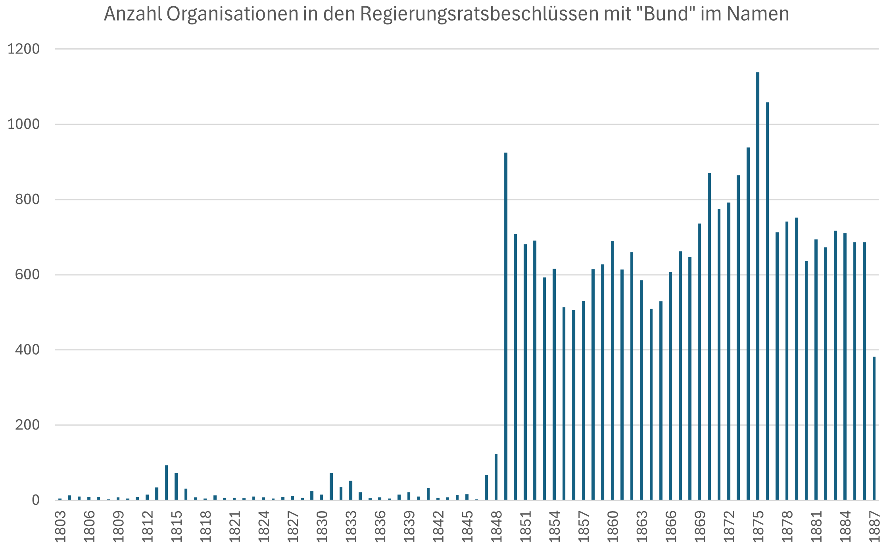

## Postprocessing

In einem weiteren Schritt werden alle NE aus den TEI-XML für die Nachbearbeitung extrahiert. Die Python-Scripte erstellen pro NE ein csv mit folgenden Feldern:

- *FilePath* (Pfad und Dateiname des TEI-XML)
- Das extrahierte NE (*persName*, *orgName* oder *placeName*)
- *documentDate* (Die Datierung des Dokuments, beispielsweise für Statistiken zu Entwicklungen über einen Zeitraum)
- *n* (Die eindeutige ID des NE für die Rücküberführung ins TEI-XML)
- *Context* (Einige Zeichen vor und nach dem NE, um Kontext zu erhalten. So wird die Identifikation des NE bei der Verknüpfung mit Normdaten einfacher.)

### Verwendung

```
python extract_persname.py /path/to/your/folder /path/to/your/output.csv
```

### Beispielauswertung




